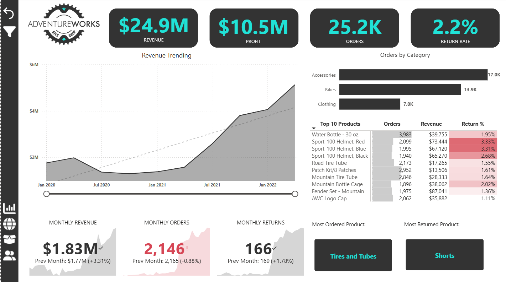
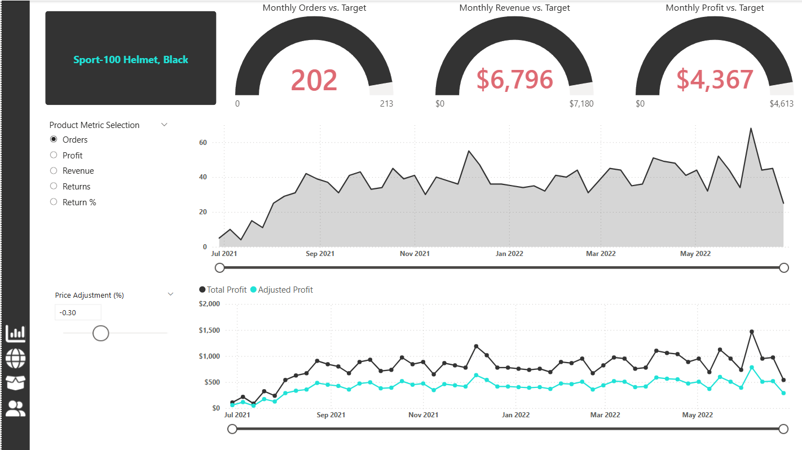
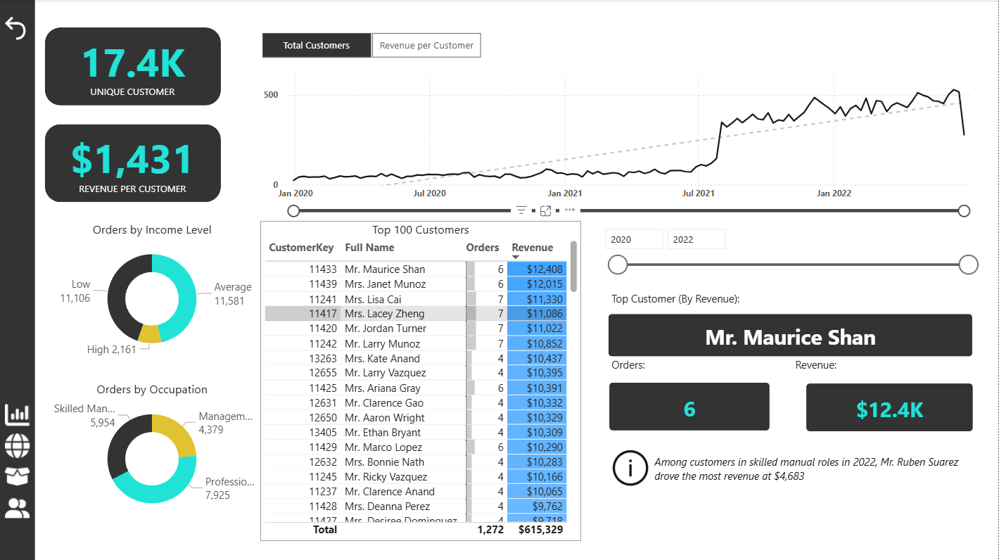
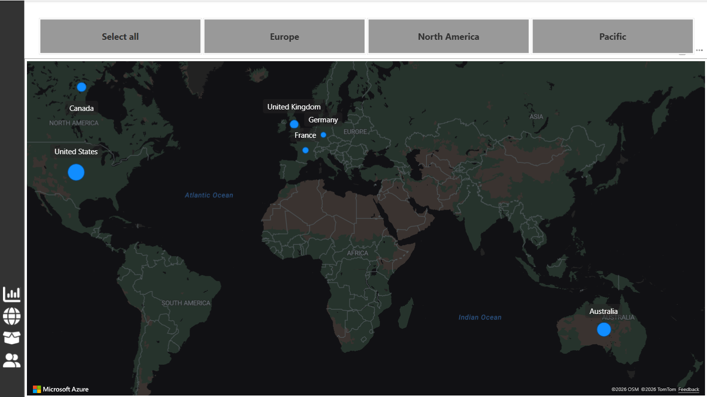

# 📊 Sales Performance Dashboard (Power BI)

## 📌 Project Overview

This project presents an interactive **Sales Performance Dashboard** built using Power BI to analyze revenue, profitability, customer behavior, and product performance. The dashboard is designed to deliver actionable insights and support data-driven decision-making.

---

## 🎯 Business Objectives

* Monitor overall **sales and profit performance**
* Track key **KPIs** such as revenue, orders, and customers
* Identify **top-performing products and regions**
* Analyze **customer trends and segmentation**
* Evaluate performance against **targets and goals**

---

## 📊 Dashboard Structure

### 🔹 Executive Dashboard

* KPIs: Revenue, Profit, Orders, Customers
* Year-to-date (YTD) performance
* Revenue vs Target comparison

### 🌍 Geographic Analysis

* Regional sales distribution
* Performance comparison across locations

### 📦 Product Analysis

* Product-level revenue and profitability
* Return rates and product trends

### 👥 Customer Analysis

* Customer segmentation
* Revenue per customer
* Purchasing behavior insights

---

## 📸 Dashboard Preview

---

## 🛠️ Tools & Technologies

* **Power BI** – Dashboard development and visualization
* **DAX (Data Analysis Expressions)** – KPI calculations and measures
* **Data Modeling** – Data relationships and transformations

---

## 📈 Key Insights

* Identified high-performing products contributing significantly to revenue
* Analyzed customer purchasing behavior and segmentation trends
* Highlighted regional variations in sales performance
* Evaluated performance against revenue and profit targets

---

## 🚀 How to Use

1. Download the `.pbix` file from this repository
2. Open it in Power BI Desktop
3. Interact with filters, slicers, and visuals

---

## 💡 Project Highlights

* Designed a **multi-page dashboard** for comprehensive business analysis
* Implemented **advanced DAX measures** for KPIs and targets
* Focused on **business insights and decision-making**
* Structured report for **executive-level reporting**

---

## 👤 Author

**Krishna Maniyar**
Data Analyst | AI & Machine Learning Enthusiast

---

## 📫 Contact

📧 [krishnamaniyarkm22@gmail.com](mailto:krishnamaniyarkm22@gmail.com)
🔗 [LinkedIn](https://www.linkedin.com/in/krishnamaniyar/)
💻 [GitHub](https://github.com/krishnamaniyar2209)
